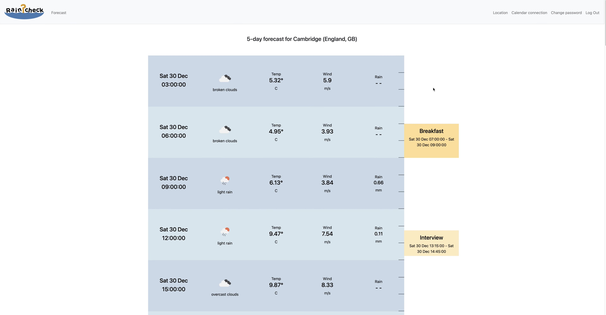

# Raincheck
#### Video Demo: https://www.youtube.com/watch?v=w6J9-hPx_8Q
#### Description:
Raincheck is a Flask-based web application which displays the next 5 days of weather forecasts alongside upcoming calendar events
from the user's personal calendar so that the weather can be assessed for each event within the context of a single user interface.

It does this by fetching forecast data from the Openweather API, which provides 5 days of weather forecasts in 3-hour intervals.

It also connects with the Google calendar API (once authenticated by the user) so it can fetch the user's own calendar events.

The weather API is also supported by the use of the Openweather geocoding API so the user can search for and set the appropriate
location for which they want to receive the forecasts for, the location details of which are saved to the user's database record
to support each forecast request and can be updated at any time.

The forecast and calendar event data is passed through to the forecast template layout and each are shown as blocks which are
scaled/translated vertically so they are proportional to the time duration of the weather and calendar events.

The forecasts and events are shown as two columns in parallel so when read as a vertical timeline the user can see which weather
conditions and events coincide.

#### Screenshot

